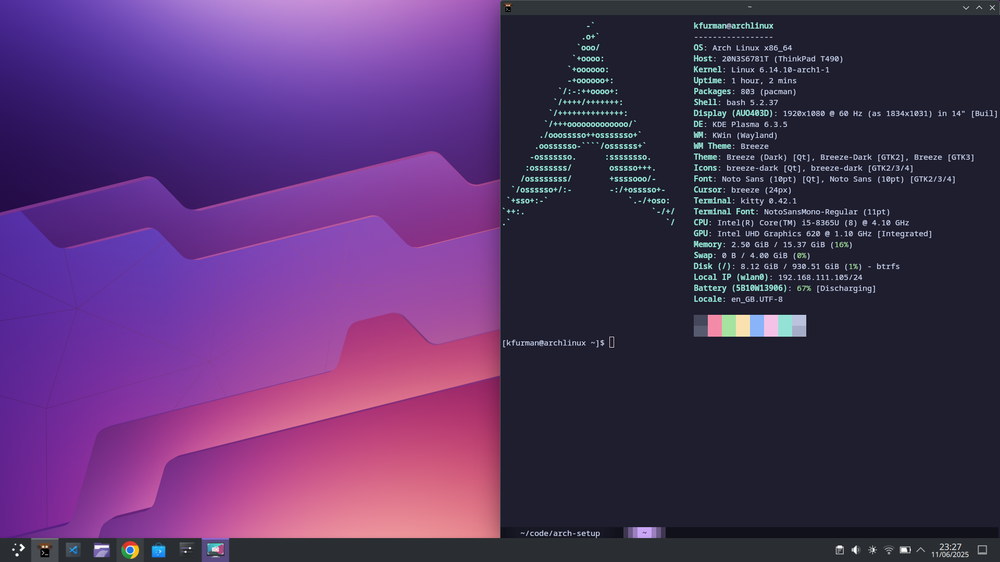

# 🛠️ Arch Post-Install Script (Kris Edition)

A post-install series of commands for Arch Linux systems using **KDE Plasma** and **NVIDIA graphics**, designed to quickly set up a development- and daily-use-ready desktop after a fresh install with `archinstall`.

---

## 🚀 What This Script Does

This scripts install essential tools, developer environments, themes, and optional desktop software. It's designed to be run **after `archinstall` completes and before your first reboot**, or right after your first login.



---

## 📦 Installs

### 🖥️ Base Applications
- `kitty` — fast GPU-accelerated terminal
- `gparted` — GUI partition manager
- `neovim` — modern Vim
- `fastfetch` — stylish system info
- `gh` (GitHub CLI) — via AUR
- `yay` — AUR helper
- `iw` - for setting WiFi region

### 🧑‍💻 Developer Toolchain
- `git`
- `rustup` (Rust toolchain installer)
- `gcc`, `cmake`, `make`
- `zeromq`, `zmqpp`
- `go`
- `npm`
- `nodejs`
- `python3-pip`
- `tmux`
- `docker`

### 🌐 Web & Communication
- `google-chrome` (AUR)
- `discord` (AUR)
- `steam` (AUR)
- `visual-studio-code-bin` (AUR)

### 🖌️ Multimedia & Productivity
- `gimp`
- `xournalpp`

### 🧰 System Enhancements
- `asusctl`, `supergfxctl`, `asusctl-rog-gui` — ASUS laptop tools (AUR)
- `nvidia`, `nvidia-utils`, `nvidia-settings` — proprietary NVIDIA drivers
- `nvidia-prime` — for hybrid graphics switching
- `catppuccin-mocha-grub-theme` — aesthetic GRUB theme

### ⚙️ Configuration Tweaks
- Set `nvim` as default editor
- Add `fastfetch` to `.bashrc` for login bling
- Clone LazyVim config
- Set up GRUB with Catppuccin theme
- Enable NVIDIA and ASUS systemd services

---

## 📜 Usage

1. Complete Arch install with KDE via `archinstall`
2. Download or clone this repo:
```bash
git clone https://github.com/yourusername/arch-postinstall
cd arch-postinstall
```
3. Run commands one by one

## 🧠 Notes
- Assumes your username is kfurman — update the script if it's different.
- yay is used for all AUR installs.
- Ensure multilib is enabled for Steam (/etc/pacman.conf).
- Recommended for personal laptops and dev machines, especially ASUS + NVIDIA setups.

## 🐧 License
MIT — feel free to fork and modify.
